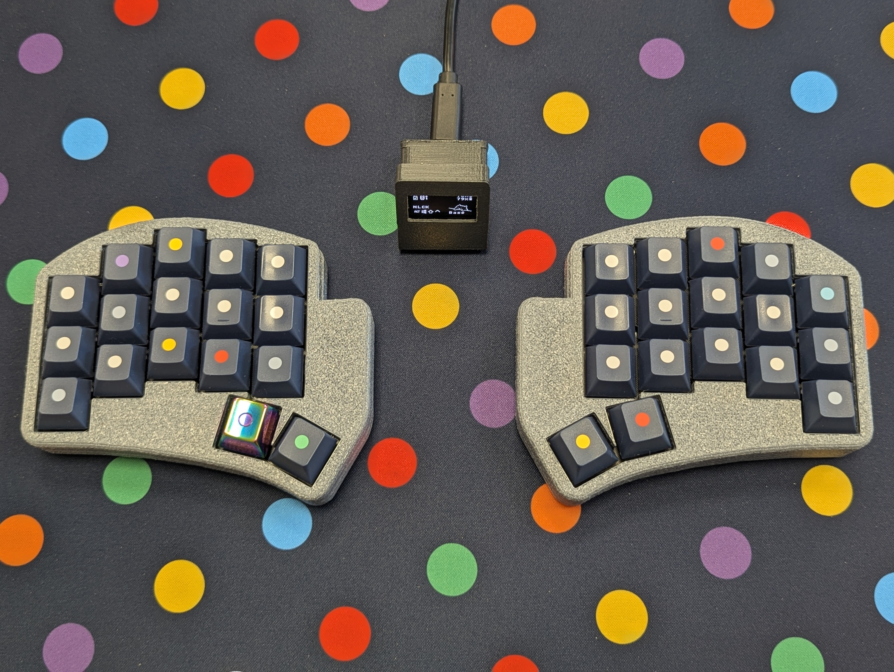

# Ferris Sweep Bling MX

ZMK configuration for the Ferris Sweep Bling MX keyboard with optional dongle display support.

Related repositories:

- [zmk-dongle-display](https://github.com/LukasStu/zmk-dongle-display)
A sleek OLED display to your ZMK dongle for live status updates.

- [Ferris-Sweep-Bling-MX-Case](https://github.com/LukasStu/Ferris-Sweep-Bling-MX-Case)
Minimalistic, great-sounding 3D-printable case with USB access, power switch slider, and reset button.